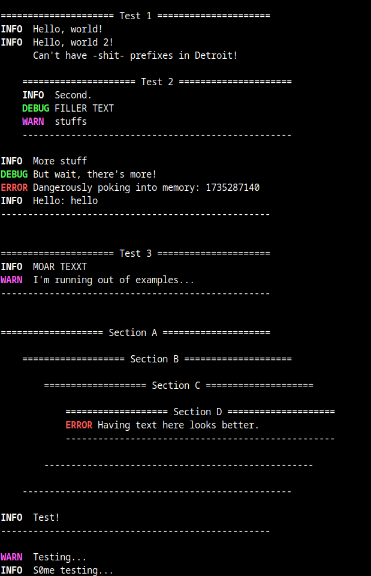

# logger
Simple logging utility for C

Features:
- Simple usage
- Pretty output
- Different verbosity level prefixes (INFO, WARN, ERROR, DEBUG) + empty prefix (NONE)
- Sections with headings and nesting
- Logging to stdout and file

Example available [example.c](example.c)

Example output:

